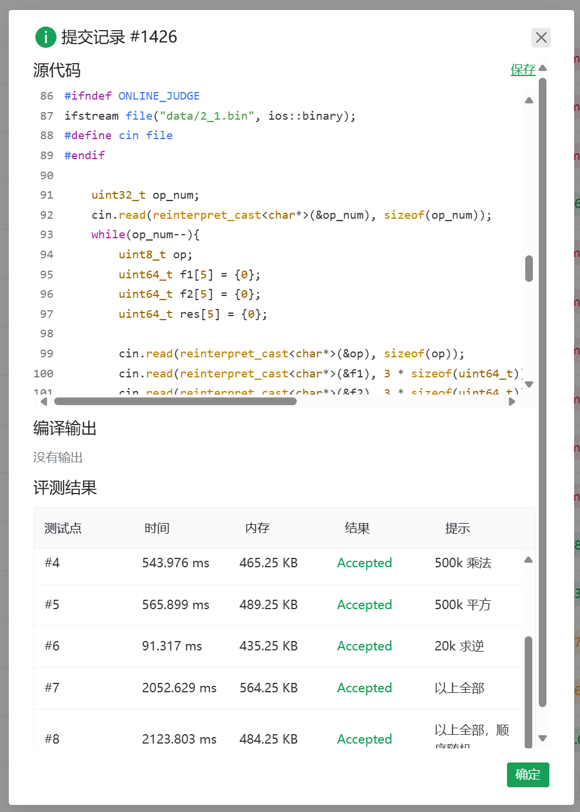

# 现代密码学实验 - 2

## 1. 实验目的

本实验旨在通过实现有限域 \( F_2^{131} \) 上的基本运算(加法、乘法、平方和求逆)，加深对有限域的理解，掌握在密码学中应用有限域特别是在椭圆曲线密码学和其他加密算法中的应用

## 2. 实验内容

- [x] 在有限域 \( F_2^{131} \) 上实现以下运算：
  1. 加法 `gf_mod()`
  2. 乘法 `gf_mul()`
  3. 平方 `gf_pow()`
  4. 求逆 `gf_inv()`
- [x] 对每种运算进行单元测试，确保实现的正确性和稳定性
- [x] 分析和比较不同运算的时间复杂度和空间复杂度

## 3. 实验原理

有限域 \( F_2^{131} \) 是一个包含 \( 2^{131} \) 个元素的二元有限域，其运算规则基于模 \( 2 \) 的算术运算

具体实现原理如下：

1. 加法：有限域中的加法运算与异或运算等价，可以直接使用二进制位的异或进行实现
   
2. 乘法：乘法运算可以通过多项式的乘法实现，结果需在一个特定的多项式模 \( m(x) \) 下进行约减，以确保结果仍然在 \( F_2^{131} \) 中，为了高效地进行乘法运算，我采用了 SSE2 指令集中的乘法指令，利用 SIMD 指令集的并行计算能力，显著提高了乘法运算的效率

3. 平方：平方运算可以视为乘法运算的一种特例，其复杂度相对较低，可以直接使用乘法算法实现，也可以依赖于有效的多项式乘法。为了优化计算，我使用 SSE2 指令集来并行处理多个数据，以提高性能

4. 求逆：在有限域中，元素的逆元可以通过扩展欧几里得算法求解，该算法用于计算 \( ax \equiv 1 \mod m(x) \)，我利用二进制展开方法对求逆过程进行优化，通过逐位处理和幂乘法有效地减少计算复杂度

## 4. 实验步骤

在此部分，我们读取运算类型及两个操作数的数据。使用 `uint64_t` 类型的数组来存储多项式的系数，支持高效的二进制操作。以下是代码段：

```cpp
#ifndef ONLINE_JUDGE // 如果不是在线评测，使用本地数据作为输入
ifstream file("data/2_1.bin", ios::binary);
#define cin file
#endif

uint32_t op_num;
cin.read(reinterpret_cast<char*>(&op_num), sizeof(op_num));
while(op_num--){
    uint64_t f1[5] = {0};  // 第一个多项式
    uint64_t f2[5] = {0};  // 第二个多项式
    uint64_t res[5] = {0}; // 结果多项式

    cin.read(reinterpret_cast<char*>(&op), sizeof(op));
    cin.read(reinterpret_cast<char*>(&f1), 3 * sizeof(uint64_t));
    cin.read(reinterpret_cast<char*>(&f2), 3 * sizeof(uint64_t));

    <...>
}
```

- `f1` 和 `f2` 是两个多项式的系数，大小为 5 的 `uint64_t` 数组用于存储每个多项式的系数
- `op` 变量存储即将执行的运算类型，可能的值包括加法、乘法、平方等。我们使用 `cin.read` 方法从标准输入读取数据
- `res` 用于存储运算结果

### 4.1 加法

以下是有限域 \( F_2^{131} \) 上的加法实现代码：

```cpp
if (op == 0x00) {
    for (int i = 0; i < 3; i++) {
        res[i] = f1[i] ^ f2[i]; // 使用异或运算进行加法
    }
}
```

当 `op` 等于 `0x00` 时，执行加法操作。利用异或运算符 `^` 实现多项式系数的加法，结果存储在 `res` 数组中

### 4.2 乘法

下面我实现了有限域上多项式的乘法，`gf_mul` 函数接收两个多项式，并返回它们的乘积

我通过 `_mm_set_epi64x` 将输入的多项式转换为 SIMD 格式，以便在并行计算中提高性能

接着我使用 `_mm_clmulepi64_si128` 计算多项式的乘积。这个指令通过两个 64 位整数生成它们的乘积，结果是 128 位。多项式的乘法可以视为多项式系数的组合，如 \(P(x) = f1(x) \cdot f2(x)\)

通过异或运算（GF(2) 中的加法），计算出最终的五项乘积。由于在有限域 GF(2) 中，乘法和加法都对应特定的运算，这里的异或实际上表示系数的求和

最后调用 `gf_mod` 函数将结果限制在特定的多项式模下，这样确保最终结果也在 GF(2^n) 的范围内

在 GF(2^n) 中，乘法和加法的规则都遵循有限域的性质，其中加法对应于异或，乘法则通过多项式的系数相乘并适当模运算来定义

```cpp
void gf_mul(uint64_t res[5], const uint64_t f1[5], const uint64_t f2[5]){
    __m128i A0 = _mm_set_epi64x(0, f1[0]);
    __m128i A1 = _mm_set_epi64x(0, f1[1]);
    __m128i A2 = _mm_set_epi64x(0, f1[2]);
    __m128i B0 = _mm_set_epi64x(0, f2[0]);
    __m128i B1 = _mm_set_epi64x(0, f2[1]);
    __m128i B2 = _mm_set_epi64x(0, f2[2]);

    __m128i P0 = _mm_clmulepi64_si128(A0, B0, 0x00);
    __m128i P1 = _mm_clmulepi64_si128(A1, B1, 0x00);
    __m128i P2 = _mm_clmulepi64_si128(A2, B2, 0x00);
    __m128i P3 = _mm_xor_si128(_mm_clmulepi64_si128(_mm_xor_si128(A0, A1), _mm_xor_si128(B0, B1), 0x00), _mm_xor_si128(P0, P1));
    __m128i P4 = _mm_xor_si128(_mm_clmulepi64_si128(_mm_xor_si128(A0, A2), _mm_xor_si128(B0, B2), 0x00), _mm_xor_si128(P0, P2));
    __m128i P5 = _mm_xor_si128(_mm_clmulepi64_si128(_mm_xor_si128(A1, A2), _mm_xor_si128(B1, B2), 0x00), _mm_xor_si128(P1, P2));

    uint64_t temp[5] = {0};
    temp[0] = _mm_extract_epi64(P0, 0);
    temp[1] = _mm_extract_epi64(P3, 0) ^ _mm_extract_epi64(P0, 1);
    temp[2] = _mm_extract_epi64(_mm_xor_si128(P1, P4), 0) ^ _mm_extract_epi64(P3, 1);
    temp[3] = _mm_extract_epi64(P5, 0) ^ _mm_extract_epi64(_mm_xor_si128(P1, P4), 1);
    temp[4] = _mm_extract_epi64(P2, 0) ^ _mm_extract_epi64(P5, 1);

    gf_mod(res, temp);
    return;
}
```

### 4.3 平方

`gf_pow` 函数接受一个长度为 5 的 `uint64_t` 数组 `f1`，计算这个多项式的平方并将结果存储在 `res` 中

首先我使用 `_mm_set_epi64x` 将 `f1` 的每个元素放入一个 128 位的 SIMD 寄存器中。这里的 `A0`, `A1`, `A2` 分别对应 `f1[0]`, `f1[1]`, `f1[2]`

接着使用 `_mm_clmulepi64_si128` 计算每个寄存器的平方。这一函数计算两个 64 位整数的乘法并返回一个 128 位的结果。具体来说

\[
P0 = f1[0]^2, \quad P1 = f1[1]^2, \quad P2 = f1[2]^2
\]

`_mm_extract_epi64` 从每个 128 位结果中提取两个 64 位结果。由于是平方运算，结果可以用一个数组 `temp` 来存储：`temp[0]` 和 `temp[1]` 存储 `P0` 的结果。`temp[2]` 和 `temp[3]` 存储 `P1` 的结果。`temp[4]` 存储 `P2` 的结果

最后调用 `gf_mod` 函数对 `temp` 进行模运算以确保结果仍然在有限域内，结果被存储到 `res` 中

```cpp
void gf_pow(uint64_t res[5], const uint64_t f1[5]){
    __m128i A0 = _mm_set_epi64x(0, f1[0]);
    __m128i A1 = _mm_set_epi64x(0, f1[1]);
    __m128i A2 = _mm_set_epi64x(0, f1[2]);

    __m128i P0 = _mm_clmulepi64_si128(A0, A0, 0x00);
    __m128i P1 = _mm_clmulepi64_si128(A1, A1, 0x00);
    __m128i P2 = _mm_clmulepi64_si128(A2, A2, 0x00);

    uint64_t temp[5] = {0};
    temp[0] = _mm_extract_epi64(P0, 0);
    temp[1] = _mm_extract_epi64(P0, 1);
    temp[2] = _mm_extract_epi64(P1, 0);
    temp[3] = _mm_extract_epi64(P1, 1);
    temp[4] = _mm_extract_epi64(P2, 0);

    gf_mod(res, temp);
    return;
}
```

### 4.4 求逆

接下来实现了一个在有限域上进行逆运算的算法

1. 定义了一个数组 `f2` 用来做 `f1` 的备份，并将数组 `f1` 的值复制到 `f2` 中

```cpp
uint64_t f2[5];
for (int i = 0; i < 5; i++) {
    f2[i] = f1[i];
}
```

2. 初始化超参数位掩码和总位数

```cpp
uint64_t n = M - 1;
uint64_t mask = 0x40;
const int totalBits = 8;
int powCount = 1;
```

`n` 是从某个参数 `M` 中减去 1 的结果，用于后续的位操作。`mask` 初始为 `0x40`(十进制为 64)，对应于二进制的第七位(即 `0x01000000`)。`totalBits` 设置为 8，表示将处理 8 位的数。`powCount` 用于跟踪当前的幂次

3. 循环处理每一位值

```cpp
for (int bit = 0; bit < totalBits - 1; bit++) {
    uint64_t temp[5] = {0};
    for (int i = 0; i < 5; i++) {
        temp[i] = f2[i];
    }

    <...>
}
```

该循环从最高位到最低位处理 `n` 的每一位。在每次迭代中，`temp` 被用作中间变量，以存储 `f2` 的当前值

4. 根据位值选择操作

```cpp
if (n & mask) {
    for (int i = 0; i < powCount; i++) {
        gf_pow(temp, temp);
    }
    gf_mul(temp, f2, temp);
    gf_pow(temp, temp);
    gf_mul(f2, f1, temp);
    powCount = powCount * 2 + 1;
} else {
    for (int i = 0; i < powCount; i++) {
        gf_pow(temp, temp);
    }
    gf_mul(f2, f2, temp);
    powCount *= 2;
}
```

在这段代码中，使用位掩码 `mask` 检查 `n` 的当前位。如果该位为 1，执行一系列的幂运算和乘法：

- `gf_pow(temp, temp)`：对 `temp` 进行幂运算 `powCount` 次
- 然后将 `temp` 与 `f2` 相乘，再对结果进行幂运算并与 `f1` 相乘，更新 `f2`
- `powCount` 更新为 `2 * powCount + 1`，反映当前幂次的增加

如果当前位为 0，则仅对 `f2` 执行幂运算并更新 `powCount` 为 `2 * powCount`

```cpp
mask >>= 1;
```

每次循环结束后，右移 `mask`，以检查下一个位

```cpp
gf_pow(res, f2);
```

循环结束后，使用 `gf_pow` 将最终结果计算并存入 `res`

## 5. 实验结果



## 6. 实验总结

本来以为会很复杂，但实际上了解原理后并不难

因为最近家事较多，有点影响课业学习，本来还想试着再提提速，也便没有了下文

之前在中山大学超算队做过很多类似的程序优化任务，SIMD 还是很熟悉的

本来还想着要不来电多线程多进程的优化，发现好像不太支持 hhh