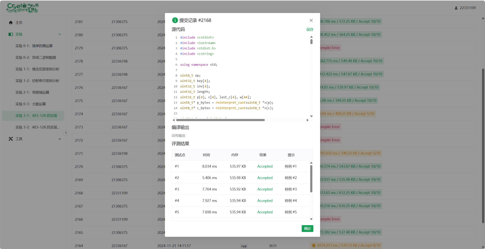

# 现代密码学实验 - 3  

实现 AES-128 CBC 工作模式的加密和解密

## 1. 实验目的  

- 熟悉 AES-128 加密算法的基本原理与实现
- 掌握分组密码的 CBC 工作模式的特点与操作
- 学习在实际中如何处理分组密码的填充与密文解码

## 2. 实验内容

1. 实现 AES-128 的 CBC 工作模式加密功能
2. 实现对应的 CBC 工作模式解密功能，确保明文可还原
3. 使用真实数据对实现进行测试，并验证结果的正确性

## 3. 实验原理

### AES-128 加密原理  

AES(Advanced Encryption Standard)是一种对称分组加密算法，采用固定 128 位(16 字节)的分组长度和密钥长度。AES 的加密过程是迭代式的，包括 初始轮处理 和 10 轮加密操作。以下为核心过程的数学描述：  

1. 数据表示  

   明文 \( P \) 和密钥 \( K \) 被表示为 \( 4 \times 4 \) 的字节矩阵：

   \[
   P = \begin{bmatrix}
   p_{00} & p_{01} & p_{02} & p_{03} \\
   p_{10} & p_{11} & p_{12} & p_{13} \\
   p_{20} & p_{21} & p_{22} & p_{23} \\
   p_{30} & p_{31} & p_{32} & p_{33}
   \end{bmatrix}, \quad
   K = \begin{bmatrix}
   k_{00} & k_{01} & k_{02} & k_{03} \\
   k_{10} & k_{11} & k_{12} & k_{13} \\
   k_{20} & k_{21} & k_{22} & k_{23} \\
   k_{30} & k_{31} & k_{32} & k_{33}
   \end{bmatrix}
   \]

2. 轮密钥生成  

   通过密钥扩展生成 11 个 \( 4 \times 4 \) 的轮密钥矩阵：  
   \[
   K^{(0)}, K^{(1)}, \ldots, K^{(10)}
   \]
   每一轮加密时使用对应的轮密钥 \( K^{(i)} \)

3. 加密轮操作  

   每一轮的加密操作包括以下步骤：  
   - 字节替代(SubBytes)：对每个字节 \( p_{ij} \) 通过 S 盒进行非线性替换
   - 行移位(ShiftRows)：对矩阵的每一行循环左移 \( i \) 个位置(第 \( i \) 行左移 \( i \) 次)
   - 列混淆(MixColumns)：对每一列执行矩阵乘法(在有限域 \( GF(2^8) \) 上)，公式为：  
     \[
     C(x) = A(x) \cdot P(x) \mod x^4 + 1
     \]
     其中 \( A(x) \) 是固定的列混淆多项式，\( P(x) \) 是列向量
   - 轮密钥加(AddRoundKey)：将当前状态矩阵与轮密钥矩阵 \( K^{(i)} \) 按位异或：  
     \[
     S = S \oplus K^{(i)}
     \]

4. 最终输出  

   最后一次加密跳过列混淆，输出密文 \( C \)

### CBC 工作模式原理  

CBC(Cipher Block Chaining，密文分组链接)是分组密码的工作模式之一，其核心思想是引入反馈机制，增强密文的随机性。数学公式如下：  

#### 加密过程  

假设明文分组为 \( P_1, P_2, \ldots, P_n \)，每组长度为 \( 128 \) 位，初始化向量(IV)为 \( IV \)。密钥为 \( K \)

1. 首先将第一个分组明文与初始化向量异或：  
   \[
   C_1 = E_K(P_1 \oplus IV)
   \]
   其中 \( E_K \) 是 AES 加密函数，\( \oplus \) 是按位异或操作

2. 对于第 \( i \) 个分组(\( i \geq 2 \))：  
   \[
   C_i = E_K(P_i \oplus C_{i-1})
   \]

3. 加密结果为密文序列 \( C_1, C_2, \ldots, C_n \)

#### 解密过程  

使用相同的密钥 \( K \) 和初始化向量 \( IV \)，逆向还原明文

1. 对于第一个分组：  
   \[
   P_1 = D_K(C_1) \oplus IV
   \]
   其中 \( D_K \) 是 AES 解密函数

2. 对于第 \( i \) 个分组(\( i \geq 2 \))：  
   \[
   P_i = D_K(C_i) \oplus C_{i-1}
   \]

3. 解密结果为明文序列 \( P_1, P_2, \ldots, P_n \)

#### 填充

由于 AES 需要明文长度是分组大小的整数倍，采用 PKCS#7 填充方案

- 若明文长度为 \( l \) 字节且 \( l \mod 16 \neq 0 \)，则填充 \( k = 16 - (l \mod 16) \) 字节，每个字节的值为 \( k \)
- 例如：明文 "hello" 被填充为 "hello\x0b\x0b\x0b\x0b\x0b\x0b\x0b\x0b\x0b\x0b\x0b"

## 4. 实验步骤

#### 加密过程

通过代码实现 AES-128 的加密模式，对明文进行分组加密

CBC 模式是一种分组加密模式，每组明文在加密前都会与前一组密文进行异或操作，具体步骤如下：

1. 对于第一组明文 \( P_1 \)，先与初始化向量 \( IV \) 进行异或：
   \[
   C_1 = E_K(P_1 \oplus IV)
   \]
   其中，\( E_K \) 为 AES 加密函数，\( \oplus \) 表示按位异或操作。

2. 对于后续分组 \( P_i \)(\( i \geq 2 \))，需要与前一个密文分组 \( C_{i-1} \) 进行异或：
   \[
   C_i = E_K(P_i \oplus C_{i-1})
   \]

3. 加密结果为密文序列 \( C_1, C_2, \ldots, C_n \)

##### 主函数 `mode_1()` 实现 CBC 加密

该函数实现了 CBC 模式的核心逻辑：

- `c` 表示当前分组的密文，初始为初始化向量 \( IV \)；
- `p` 表示明文分组，长度为 128 位(16 字节)；
- `length` 表示剩余未处理的明文长度。

```c
void mode_1(){
    memcpy(c, iv, 16); // 将初始化向量赋值给 c
    while(length >= 16){
        length -= 16;
        fread(&p, sizeof(p), 1, stdin); // 从输入中读取一个明文分组
        Add_word(c, p);                // 与当前密文分组(或 IV)异或
        decode(c, c_bytes, w);         // 加密操作
        fwrite(&c, sizeof(c), 1, stdout); // 输出密文
    }
    memset(p_bytes + length, 16 - length, 16 - length); // 填充剩余明文
    fread(&p, sizeof(uint8_t), length, stdin);
    Add_word(c, p);
    decode(c, c_bytes, w);
    fwrite(&c, sizeof(c), 1, stdout);
    return;
}
```

异或操作：`Add_word(c, p)` 实现了 CBC 模式中的异或操作AES 加密：`decode(c, c_bytes, w)` 调用了 AES 加密函数。

##### AES 加密函数 `decode()`

该函数实现了 AES-128 加密的核心步骤，包括添加密钥、字节代换、行移位、列混合以及轮密钥添加

```c
void decode(uint32_t * c, uint8_t * c_bytes, uint32_t * w){
    Add_word(c, w); // 添加初始轮密钥
    for(int i = 1; i < 10; ++i){ // 共进行 10 轮加密
        for(int i = 0; i < 16; ++i){
            c_bytes[i] = SBOX[c_bytes[i]]; // 字节代换
        }
        // 行移位操作
        swap(c_bytes[1], c_bytes[5]);
        swap(c_bytes[5], c_bytes[9]);
        swap(c_bytes[9], c_bytes[13]);
        swap(c_bytes[2], c_bytes[10]);
        swap(c_bytes[6], c_bytes[14]);
        swap(c_bytes[15], c_bytes[11]);
        swap(c_bytes[11], c_bytes[7]);
        swap(c_bytes[7], c_bytes[3]);
        Mix_c(c_bytes); // 列混合操作
        Add_word(c, w + (i * 4)); // 添加轮密钥
    }
    // 最后一轮仅进行字节代换、行移位和轮密钥添加
    for(int i = 0; i < 16; ++i){
        c_bytes[i] = SBOX[c_bytes[i]];
    }
    swap(c_bytes[1], c_bytes[5]);
    swap(c_bytes[5], c_bytes[9]);
    swap(c_bytes[9], c_bytes[13]);
    swap(c_bytes[2], c_bytes[10]);
    swap(c_bytes[6], c_bytes[14]);
    swap(c_bytes[15], c_bytes[11]);
    swap(c_bytes[11], c_bytes[7]);
    swap(c_bytes[7], c_bytes[3]);
    Add_word(c, w + 40);
    return;
}
```

代换操作：通过查找 S 盒(`SBOX`)，实现非线性变换。行移位：将每一行的数据循环左移不同位数，增加扩散性。列混合：调用 `Mix_c` 函数，进行矩阵乘法以混合每列数据。轮密钥添加：每轮与密钥调度生成的子密钥异或。

##### 列混合函数 `Mix_c()`

列混合步骤在有限域 \( GF(2^8) \) 上实现，函数 `func_x` 用于计算有限域上的乘法。

```c
void Mix_c(uint8_t * c){
    uint8_t t, u;
    for(int i = 0; i < 16; i+=4){
        t = c[i] ^ c[i + 1] ^ c[i + 2] ^ c[i + 3];
        u = c[i];
        c[i] ^= t ^ func_x(c[i] ^ c[i + 1]); // 计算新值
        c[i + 1] ^= t ^ func_x(c[i + 1] ^ c[i + 2]);
        c[i + 2] ^= t ^ func_x(c[i + 2] ^ c[i + 3]);
        c[i + 3] ^= t ^ func_x(c[i + 3] ^ u);
    }
    return;
}
```

有限域上的操作：列混合核心在于有限域上的乘法计算，保证扩散效果。结果迭代：对每一列数据独立处理并更新。

#### 解密过程

在 AES-128 的解密过程中，密文分组 \( C_1, C_2, \ldots, C_n \) 使用相同的密钥 \( K \) 和初始化向量 \( IV \) 被逐步还原为明文分组 \( P_1, P_2, \ldots, P_n \)。以下为主要步骤：

1. 第一个分组解密  
   第一个密文分组 \( C_1 \) 被解密为明文分组 \( P_1 \)，过程如下：  
   \[
   P_1 = D_K(C_1) \oplus IV
   \]  
   其中：
   - \( D_K \) 是 AES 的解密函数。
   - \( \oplus \) 表示按位异或。

2. 后续分组解密  
   对于第 \( i \) 个密文分组 (\( i \geq 2 \))，解密公式为：  
   \[
   P_i = D_K(C_i) \oplus C_{i-1}
   \]  
   即将前一个密文分组 \( C_{i-1} \) 与当前密文分组 \( C_i \) 的解密结果异或后得到明文分组 \( P_i \)。

3. 结果处理  
   如果密文最后一个分组含有填充数据（基于 PKCS#7 填充方式），需要按照填充规则去掉多余字节，恢复原始明文。

##### `mode_2()` 函数：解密流程控制

```c
void mode_2(){
    memcpy(last_c, inv, 16);
    
    while(length > 0) {
        fread(&c, sizeof(c), 1, stdin);
        memcpy(p, c, 16);
        
        inv_decode(p, p_bytes, w);
        Add_word(p, last_c);
        
        memcpy(last_c, c, 16);
        
        int l = p_bytes[16 - 1];
        if(length == 16) {
            // 验证填充是否合法，若不合法则重置 l
            for(int i = 1; i < l; ++i){
                if(p_bytes[16 - 1 - i] != l) {
                    l = 0;
                    break;
                }
            }
            // 去掉填充字节，输出有效数据
            fwrite(&p, sizeof(uint8_t), 16 - l, stdout);
        } else {
            fwrite(&p, sizeof(p), 1, stdout);
        }
        length -= 16;  // 更新剩余长度
    }
    return;
}
```

1. 初始化变量  

   - `last_c` 用于保存前一个密文分组，初始值为初始化向量 \( IV \)。
   - `length` 为密文的总长度。

2. 分组解密  

   循环中，每次读取一个分组 \( C_i \)，调用 `inv_decode` 进行 AES 解密。解密后的结果与 `last_c`（即前一个密文分组）进行异或操作，得到明文分组 \( P_i \)。  
   解密完成后，将当前密文分组 \( C_i \) 更新为 `last_c`，为下一轮解密做准备。

3. 填充检查与输出  

   如果是最后一个分组，基于 PKCS#7 填充规则检查填充的合法性，并去掉填充字节，输出有效的明文内容。

##### `inv_decode()` 函数：AES 解密实现

```c
void inv_decode(uint32_t * c, uint8_t * c_bytes, uint32_t * w){
    Add_word(c, w + 40);  // 使用最后一轮的轮密钥加密
    
    for(int i = 9; i > 0; --i) {  // 从第 9 轮到第 1 轮进行解密
        // 逆移位行操作
        swap(c_bytes[9], c_bytes[13]);
        swap(c_bytes[5], c_bytes[9]);
        swap(c_bytes[1], c_bytes[5]);
        swap(c_bytes[2], c_bytes[10]);
        swap(c_bytes[6], c_bytes[14]);
        swap(c_bytes[7], c_bytes[3]);
        swap(c_bytes[11], c_bytes[7]);
        swap(c_bytes[15], c_bytes[11]);
        
        inv_sub_byte(c_bytes);  // 执行逆字节代换
        
        Add_word(c, w + (i * 4));  // 加上轮密钥
        
        uint8_t u, v;
        // 逆列混淆操作
        for(int i = 0; i < 16; i+=4) {
            u = func_x(func_x(c_bytes[i] ^ c_bytes[i + 2]));
            v = func_x(func_x(c_bytes[i + 1] ^ c_bytes[i + 3]));
            c_bytes[i] ^= u;
            c_bytes[i + 1] ^= v;
            c_bytes[i + 2] ^= u;
            c_bytes[i + 3] ^= v;
        }
        Mix_c(c_bytes);  // 逆列混淆
    }

    // 最后一轮的逆操作
    swap(c_bytes[9], c_bytes[13]);
    swap(c_bytes[5], c_bytes[9]);
    swap(c_bytes[1], c_bytes[5]);
    swap(c_bytes[2], c_bytes[10]);
    swap(c_bytes[6], c_bytes[14]);
    swap(c_bytes[7], c_bytes[3]);
    swap(c_bytes[11], c_bytes[7]);
    swap(c_bytes[15], c_bytes[11]);
    
    inv_sub_byte(c_bytes);  // 逆字节代换
    Add_word(c, w);  // 最后加上轮密钥
    
    return;
}
```

1. 轮密钥加法  

   首先对输入密文分组 \( C_i \) 执行最后一轮的轮密钥加法操作。该操作使用最后一轮的轮密钥 \( w_{40}, w_{41}, w_{42}, w_{43} \)。

2. 逆轮变换  

   从第 9 轮到第 1 轮，依次执行：
   - 逆移位行：通过 `swap` 操作实现行内字节位置的还原。
   - 逆字节代换：通过 `inv_sub_byte` 函数执行逆 S 盒变换。
   - 逆列混淆：通过 `Mix_c` 函数对列操作进行还原。
   - 轮密钥加法：使用对应轮的密钥对当前分组进行 XOR 操作。

3. 最终还原  

   最后一轮执行逆移位行、逆字节代换和轮密钥加法，最终还原出解密结果。

##### `Mix_c()` 函数：逆列混淆

```c
void Mix_c(uint8_t * c){
    uint8_t t, u;
    for(int i = 0; i < 16; i+=4) {
        t = c[i] ^ c[i + 1] ^ c[i + 2] ^ c[i + 3];
        u = c[i];
        c[i] ^= t ^ func_x(c[i] ^ c[i + 1]);
        c[i + 1] ^= t ^ func_x(c[i + 1] ^ c[i + 2]);
        c[i + 2] ^= t ^ func_x(c[i + 2] ^ c[i + 3]);
        c[i + 3] ^= t ^ func_x(c[i + 3] ^ u);
    }
    return;
}
```

AES 的列混淆操作在解密过程中需要逆操作。

`Mix_c` 中依次对 4 字节一组的列进行处理，通过伪代码描述如下：

- 计算中间值 \( u \) 和 \( v \)，分别为列内字节异或后的结果。
- 使用 `func_x` 函数计算倍增的异或结果，对列内字节逐一进行还原。

## 5. 实验结果

