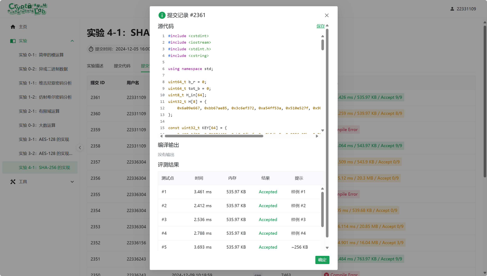

# 现代密码学实验 - 4

## 1. 实验目的

- 掌握 SHA256 算法的基本原理和实现方法
- 理解哈希函数的单向性和抗碰撞性
- 实现 SHA256 算法，并对给定数据进行哈希运算，验证结果正确性

## 2. 实验内容

- 实现 SHA256 哈希函数的主要步骤，包括填充、消息分组、初始化哈希值、压缩函数以及最终的哈希值计算
- 输入一组测试数据，输出对应的 SHA256 哈希值
- 验证实现的 SHA256 函数结果是否与标准库一致

## 3. 实验原理

SHA256 是一种安全哈希算法，属于 SHA-2 系列。其主要工作原理如下：

1. 消息填充与扩展：将消息填充到长度是 512 位的倍数，附加一个 1 位，后续附加长度表示的 64 位
2. 初始化哈希值：使用一组固定的 8 个 32 位初始值
3. 消息分组处理：将填充后的消息分为多个 512 位分组
4. 压缩函数：对每个分组执行 64 轮哈希运算，使用特定的逻辑函数、常数 K 和消息分组扩展值更新哈希值
5. 输出哈希值：最终的 256 位哈希值由拼接的 8 个 32 位值组成

SHA256 具备单向性(无法从哈希值反推出原始数据)和抗碰撞性(难以找到不同数据具有相同哈希值)

## 4. 实验步骤

### 初始化常量

哈希初始值 (`H`)

在全局变量 `H[8]` 中，初始化 SHA256 的 8 个初始哈希值。这些值来自 SHA256 规范，是根据分数部分提取的常量

```cpp
uint32_t H[8] = {
    0x6a09e667, 0xbb67ae85, 0x3c6ef372, 0xa54ff53a, 
    0x510e527f, 0x9b05688c, 0x1f83d9ab, 0x5be0cd19
};
```

圆常数 (`KEY`)  

定义 64 个 32 位常量，存储在数组 `KEY` 中。它们用于压缩函数的每轮运算

```cpp
const uint32_t KEY[64] = { ... }; 
```

### 消息填充

在 `main` 函数中，首先从标准输入读取数据块

```cpp
b_r = fread(H_in, 1, sizeof(H_in), stdin);
```

每次读取 64 字节数据到缓冲区 `H_in`
如果读取的字节数为 64，则调用 `hash_func` 处理完整的分组
对于不足 64 字节的最后分组，进行填充

在读取数据后，向当前缓冲区中添加 `0x80`，表示填充起始字节

```cpp
H_in[b_r] = 0x80;
```

如果填充后的总长度不足 56 字节，用 `0x00` 填满，剩余 8 字节用于表示消息长度（以比特为单位）
如果填充后的长度超过 56 字节，分为两个分组处理

第一分组填充至 64 字节并进行哈希处理
第二分组仅存放原始消息长度

### 消息分组扩展

`hash_func` 函数实现了消息的扩展和处理

将 64 字节消息分为 16 个 32 位字，存入数组 `a`

```cpp
for (int b = 0; b < 16; ++b) {
    a[b] = (H_in[4 * b] << 24) | (H_in[4 * b + 1] << 16) |
            (H_in[4 * b + 2] << 8) | H_in[4 * b + 3];
}
```

通过位移操作将 4 个字节合并为一个 32 位整型字

使用公式扩展到 64 个字

假设消息分组 \( M \) 已被划分为 16 个初始 32 位字，记为 \( W_0, W_1, \dots, W_{15} \)。扩展至 \( W_{16}, W_{17}, \dots, W_{63} \) 时，公式为：

\[
\sigma_0(x) = \text{ROTR}^7(x) \oplus \text{ROTR}^{18}(x) \oplus \text{SHR}^3(x)
\]
\[
\sigma_1(x) = \text{ROTR}^{17}(x) \oplus \text{ROTR}^{19}(x) \oplus \text{SHR}^{10}(x)
\]
\[
W_t = W_{t-16} + \sigma_0(W_{t-15}) + W_{t-7} + \sigma_1(W_{t-2}) \quad (t = 16, 17, \dots, 63)
\]

```cpp
for (int b = 16; b < 64; ++b) {
    uint32_t c = ((a[b - 15] >> 7) | (a[b - 15] << 25)) ^
                ((a[b - 15] >> 18) | (a[b - 15] << 14)) ^ 
                (a[b - 15] >> 3);
    uint32_t d = ((a[b - 2] >> 17) | (a[b - 2] << 15)) ^
                ((a[b - 2] >> 19) | (a[b - 2] << 13)) ^ 
                (a[b - 2] >> 10);
    a[b] = a[b - 16] + c + a[b - 7] + d;
}
```

每个扩展字是前面字的线性组合，结合旋转和移位操作生成

### 压缩函数

=初始化工作变量为当前哈希状态

```cpp
uint32_t b = H[0], c = H[1], d = H[2], e = H[3];
uint32_t f = H[4], g = H[5], a1 = H[6], a2 = H[7];
```

执行 64 轮压缩运算，每轮更新工作变量，公式如下

### **SHA-256 压缩运算公式**

在 SHA-256 的压缩阶段，64 轮迭代更新 8 个工作变量（\(a, b, c, d, e, f, g, h\)）。公式如下

1. \(\Sigma_0(x)\)：对 \(x\) 进行循环右移和异或运算：
   \[
   \Sigma_0(x) = \text{ROTR}^2(x) \oplus \text{ROTR}^{13}(x) \oplus \text{ROTR}^{22}(x)
   \]
2. \(\Sigma_1(x)\)：对 \(x\) 进行循环右移和异或运算：
   \[
   \Sigma_1(x) = \text{ROTR}^6(x) \oplus \text{ROTR}^{11}(x) \oplus \text{ROTR}^{25}(x)
   \]
3. Ch(x, y, z)：选择函数，表示在 \(x\) 为 1 时选择 \(y\)，否则选择 \(z\)：
   \[
   \text{Ch}(x, y, z) = (x \land y) \oplus (\lnot x \land z)
   \]
4. Maj(x, y, z)：多数函数，表示 \(x, y, z\) 中至少两个变量的按位多数值：
   \[
   \text{Maj}(x, y, z) = (x \land y) \oplus (x \land z) \oplus (y \land z)
   \]

设当前轮次为 \(t\)，当前的工作变量为 \(a, b, c, d, e, f, g, h\)，更新如下

计算中间变量

   \[
   T_1 = h + \Sigma_1(e) + \text{Ch}(e, f, g) + K_t + W_t
   \]
   \[
   T_2 = \Sigma_0(a) + \text{Maj}(a, b, c)
   \]

```cpp
uint32_t c1 = ((f >> 6) | (f << 26)) ^
            ((f >> 11) | (f << 21)) ^
            ((f >> 25) | (f << 7));
uint32_t d1 = (f & g) ^ ((~f) & a1);
uint32_t e1 = a2 + c1 + d1 + KEY[b1] + a[b1];
uint32_t f1 = ((b >> 2) | (b << 30)) ^
            ((b >> 13) | (b << 19)) ^
            ((b >> 22) | (b << 10));
uint32_t g1 = (b & c) ^ (b & d) ^ (c & d);
uint32_t a3 = f1 + g1;

a2 = a1;
a1 = g;
g = f;
f = e + e1;
e = d;
d = c;
c = b;
b = e1 + a3;
``` 

最后，将工作变量的结果累加到哈希状态

```cpp
H[0] += b;
H[1] += c;
H[2] += d;
H[3] += e;
H[4] += f;
H[5] += g;
H[6] += a1;
H[7] += a2;
```

### 输出哈希值

在 `main` 函数中，将哈希值输出

每个 32 位整型的哈希值按字节逆序输出

```cpp
for (int i = 0; i < 8; ++i) {
    for (int j = 0; j < 4; ++j) {
        fwrite(H_out + 4 * i + 3 - j, sizeof(uint8_t), 1, stdout);
    }
}
```

输出的结果是标准的 SHA256 哈希值，共 32 字节

## 5. 实验结果

