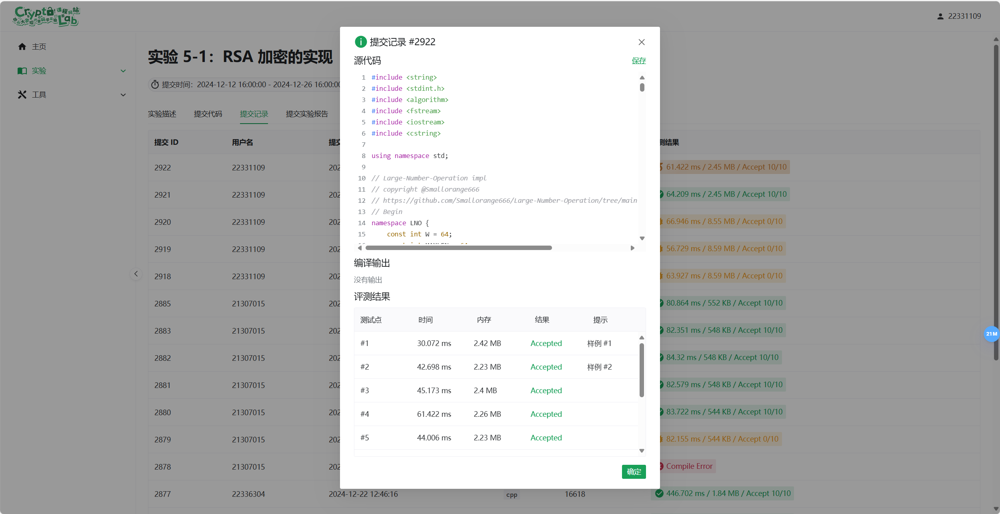

# 现代密码学实验 - 5

## 1. 实验目的

学习并实现 RSA 加密算法，理解 RSA 的加密和解密过程，掌握公钥加密与私钥解密的基本原理

## 2. 实验内容

1. 理解 RSA 加密算法的基本原理
2. 编写程序实现 RSA 加密与解密
3. 使用 RSA 算法对明文进行加密，密文进行解密，验证其正确性
4. 掌握如何生成 RSA 密钥对，包括公钥和私钥

## 3. 实验原理

RSA(Rivest–Shamir–Adleman)是一种广泛使用的公钥加密算法。其安全性基于大整数分解的困难性

RSA 加密的核心原理是通过两个密钥进行加密和解密:公钥(用于加密)和私钥(用于解密)

RSA 加密与解密的基本过程

1. 密钥生成

   - 选择两个大素数 \( p \) 和 \( q \)。
   - 计算 \( n = p \times q \)，其中 \( n \) 是模数。
   - 计算 \( \phi(n) = (p-1)(q-1) \)，其中 \( \phi(n) \) 是欧拉函数。
   - 选择一个整数 \( e \)，满足 \( 1 < e < \phi(n) \)，且 \( e \) 与 \( \phi(n) \) 互质(通常选择小的值如 65537)。
   - 计算 \( d \)，使得 \( e \times d \equiv 1 \ (\text{mod} \ \phi(n)) \)，即 \( d \) 是 \( e \) 的模 \( \phi(n) \) 的逆元。

2. 加密

   - 使用公钥 \( (e, n) \) 对明文进行加密。假设明文为 \( m \)，则密文 \( c \) 通过公式计算:  
     \[
     c = m^e \ (\text{mod} \ n)
     \]

3. 解密

   - 使用私钥 \( (d, n) \) 对密文进行解密。密文 \( c \) 通过公式计算恢复明文:  
     \[
     m = c^d \ (\text{mod} \ n)
     \]

## 4. 实验步骤

在本实验中，代码实现了 RSA 加密算法的加密过程，具体如下

- `uint64_t n[32];` 和 `uint64_t e[32];`:分别表示 RSA 公钥中的模数 \( n \) 和公钥指数 \( e \)，它们被存储为长度为 32 的数组。通常，RSA 中的模数 \( n \) 由多个 64 位的整数组成，以适应大数运算

- `uint8_t message_length;`:表示消息的长度

- `uint8_t encoded_message[256];`:存储经过编码的消息。为了确保消息符合 RSA 加密的要求，消息可能需要经过一定的编码或填充，填充后消息会作为输入传递给加密函数

- `uint64_t encoded_message_blocks[32];`:存储编码后的消息的分块，每个块是 64 位，用于后续的加密运算

- `uint64_t modulus_blocks[64];`、`uint64_t public_exponent_blocks[64];`、`uint64_t message_blocks[64];` 和 `uint64_t cipher_blocks[64];`:存储对应的分块信息，用于 RSA 算法的逐块加密。每个分块的大小为 64 位

`func_run` 是主函数，它负责将整个 RSA 加密过程串联起来。具体步骤如下:

### 4.1 消息填充与编码:

```cpp
func_fill(message, length, encoded_message);
```

首先，输入消息通过 `func_fill` 函数进行处理和编码，存储到 `encoded_message` 数组中。这一步可能涉及消息的填充或格式转换，以确保消息适合 RSA 加密

`func_fill` 函数的作用是将输入消息填充为一个符合加密要求的编码消息。这个过程使用了加密填充算法，类似于 RSA 的 PKCS#1 填充方案，具体过程如下:

首先，定义了两个常量数组 `seed` 和 `L`，用于生成填充数据

```cpp
uint8_t seed[32] = { ... };
uint8_t L[32] = { ... };
```

接着，构造一个填充块 `DB`，它由以下几个部分组成:
- 数组 `L` 的内容填充到 `DB` 的前 32 字节
- 接下来填充 0x00，直到数组的长度为 223 字节，预留空间
- 在填充的数据中插入 0x01 字节，表示数据的结束部分
- 最后将输入消息 `m` 填充到数组 `DB` 的尾部

```cpp
uint8_t DB[223];
for (int i = 0; i < 32; i++) {
    DB[i] = L[i];
}
for (int i = 32; i < 223 - len - 1; i++) {
    DB[i] = 0x00;
}
DB[222 - len] = 0x01;
for (int i = 0; i < len; i++) {
    DB[223 - len + i] = m[i];
}
```

然后，生成 `MaskedDB` 数组，它是 `DB` 数组的掩码版本。通过使用 `func_mgf1` 函数对 `seed` 进行掩码生成，并将结果与 `DB` 进行异或操作，得到 `MaskedDB`:

```cpp
uint8_t MaskedDB[223];
func_mgf1(seed, MaskedDB);
for (int i = 0; i < 223; i++) {
    MaskedDB[i] ^= DB[i];
}
```

接下来，生成 `MaskedSeed` 数组，它是 `MaskedDB` 数组的掩码版本。通过使用 `func_mgf2` 函数对 `MaskedDB` 进行进一步的掩码生成，并将结果与 `seed` 进行异或操作，得到最终的 `MaskedSeed`:

```cpp
uint8_t MaskedSeed[32];
func_mgf2(MaskedDB, MaskedSeed);
for (int i = 0; i < 32; i++) {
    MaskedSeed[i] ^= seed[i];
}
```

最后，生成最终的编码消息 `em`。数组 `em` 由以下三部分组成:
- 第一个字节设置为 `0x00`，作为标识符
- 接下来的 32 字节来自 `MaskedSeed`
- 剩下的 223 字节来自 `MaskedDB`

```cpp
em[0] = 0x00;
for (int i = 1; i < 33; i++) {
    em[i] = MaskedSeed[i - 1];
}
for (int i = 33; i < 256; i++) {
    em[i] = MaskedDB[i - 33];
}
```

最终，`em` 数组即为完整的加密填充消息，它可以作为后续加密过程的输入

### 4.2 字节序转换:

```cpp
func_little(n);
func_little(e);
```

`func_little` 可能是用于字节序转换的函数，将模数 \( n \) 和公钥指数 \( e \) 转换为小端字节序格式，确保大数计算时字节顺序的一致性

`func_little` 函数的作用是将 32 个 64 位整数数组 `a` 的字节序转换为小端字节序，并且将整个数组反转。这意味着:

- 每个 64 位的整数将被转换为小端格式(低位字节放在前面)
- 数组的顺序会被反转，使得最后的元素成为第一个元素，第一的元素变成最后的元素

具体代码解析如下:

首先，遍历输入数组 `a` 中的每个 64 位整数 `value`，对每个整数进行字节顺序的转换:

```cpp
for (size_t i = 0; i < 32; ++i) {
    uint64_t value = a[i];
    a[i] = ((value & 0xFF00000000000000) >> 56) |
        ((value & 0x00FF000000000000) >> 40) |
        ((value & 0x0000FF0000000000) >> 24) |
        ((value & 0x000000FF00000000) >> 8) |
        ((value & 0x00000000FF000000) << 8) |
        ((value & 0x0000000000FF0000) << 24) |
        ((value & 0x000000000000FF00) << 40) |
        ((value & 0x00000000000000FF) << 56);
}
```

该段代码通过掩码和位移操作将 `value` 中的每个字节位置进行重新排列，从而实现了大端字节序到小端字节序的转换。具体来说:

- `0xFF00000000000000` 等掩码用于提取 `value` 中每个字节的位置。
- 通过位移操作将每个字节移动到小端格式中的正确位置。

接着，使用一个临时数组 `temp` 来存储数组 `a` 的当前内容，并且将数组 `a` 中的元素顺序反转:

```cpp
uint64_t temp[32];
memcpy(temp, a, 32 * sizeof(uint64_t));
for (int i = 0; i < 32; i++) {
    a[i] = temp[31 - i];
}
```

`memcpy` 函数将原数组 `a` 的内容复制到临时数组 `temp` 中。接着，通过反转 `temp` 数组的顺序，将反转后的数据存回到数组 `a` 中

### 4.3 消息分块:

```cpp
func_tran(encoded_message, encoded_message_blocks);
func_little_em(encoded_message_blocks);
```

`func_tran` 将编码后的消息分割成 64 位大小的块，存储在 `encoded_message_blocks` 中。`func_little_em` 可能用于进一步的字节序或其他格式的转换

```cpp
func_kuo(n, modulus_blocks);
func_kuo(e, public_exponent_blocks);
func_kuo(encoded_message_blocks, message_blocks);
```

`func_kuo` 将模数 \( n \)、公钥指数 \( e \) 和编码后的消息分块分别转换成相应的 64 位块，存储在 `modulus_blocks`、`public_exponent_blocks` 和 `message_blocks` 数组中

```cpp
memcpy(LNO::P, modulus_blocks, 64 * sizeof(uint64_t));
LNO::P_bits = LNO::getBits(LNO::P);
LNO::pre_cal();
```

这些步骤将 `modulus_blocks` 数组中的数据传递给 `LNO` 模块，用于进行 RSA 模运算。`LNO::P_bits` 可能表示与模数相关的位数，`LNO::pre_cal()` 是初始化或预计算的过程

### 4.4 蒙哥马利乘法:

```cpp
LNO::mod_pow_mont(cipher_blocks, message_blocks, public_exponent_blocks);
```

在这一步，RSA 加密的核心操作，`LNO::mod_pow_mont` 函数实现了蒙哥马利模幂运算 \( c = m^e \ (\text{mod} \ n) \)。蒙哥马利模幂运算是一种优化的加密算法，它避免了在大数计算中出现昂贵的除法操作，提供了更高效的计算方式

首先，函数定义了若干个临时数组，并对其进行初始化:

```cpp
uint64_t temp[MAXLEN] = { 0 };
uint64_t base[MAXLEN] = { 0 };
```

- `temp` 用于存储中间结果。
- `base` 存储底数 \( a \) 的蒙哥马利表示。

然后，使用 `REDC` 函数将常数 `ONE` 和 `R2` 转换为蒙哥马利表示，并赋值给 `temp` 和 `base`:

```cpp
REDC(temp, ONE, R2);
REDC(base, a, R2);
```

这里 `REDC` 是一个执行蒙哥马利归约(蒙哥马利乘法)的函数，用来将一个值转换为蒙哥马利域中的表示

接下来进入了模幂的主要循环部分:

```cpp
for (int i = 0; i < MAXLEN; i++) {
    if (bigger(temp, ONE) && b[i] == 0)
        break;
    for (int j = 0; j < W; j++) {
        if (b[i] & POW2[j])
            REDC(temp, temp, base);

        REDC(base, base, base);
    }
}
```

- 外层循环:遍历 `b` 数组中的每一位(假设 `b` 存储的是指数 \( b \) 的大数表示)。如果 `temp` 不等于 `ONE` 且当前 `b[i]` 为零，提前结束循环
- 内层循环:`b[i]` 的每一位被分解为若干个二进制位，每次计算时进行蒙哥马利乘法。`POW2[j]` 应该是表示不同二进制位的常量(如 1, 2, 4, 8, …)

对于每一位 `b[i]`，如果该位为 1，执行蒙哥马利乘法:

```cpp
REDC(temp, temp, base);
```

然后，`base` 会进行平方操作，更新为 `base^2`(即 \( base = base^2 \ (\text{mod} \ n) \)):

```cpp
REDC(base, base, base);
```

这种方法就是通过逐位拆解二进制指数，利用蒙哥马利方法实现快速的模幂运算

最后，使用 `REDC` 将 `temp` 转换回常规表示并存储到结果数组 `res` 中，对密文块进行字节序转换，确保结果符合预期的格式

```cpp
REDC(res, temp, ONE);
func_little(cipher_blocks);
```

## 5. 实验结果



## 6. 思考题

这次试验好像没有思考题