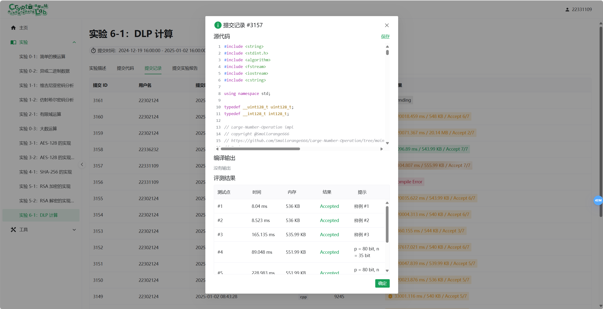
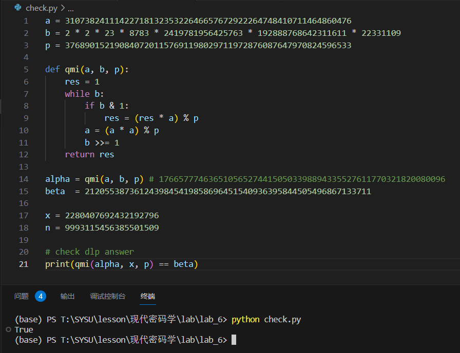

# 现代密码学实验 6

## 1. 实验目的

本实验旨在通过实现 Pollard ρ 算法，深入理解离散对数问题(DLP)的计算方法，并掌握该算法在密码学中的应用

通过实验，分析算法的性能及其在实际问题中的有效性

## 2. 实验内容

1. 理解离散对数问题(DLP):研究 DLP 的基本概念及其在密码学中的重要性
2. 学习 Pollard ρ 算法:掌握 Pollard ρ 算法的基本原理、步骤及其数学推导
3. 实现 Pollard ρ 算法:编写代码实现该算法，并用于解决给定的 DLP 实例
4. 实验结果分析:通过实验数据验证算法的正确性和效率，并分析其性能

## 3. 实验原理

### 离散对数问题(DLP)的数学原理

离散对数问题(DLP)是密码学中的一个基本问题，其定义如下:

给定一个有限循环群 \( G \)，其生成元为 \( g \)，以及群中的一个元素 \( h \)，DLP 要求找到一个整数 \( x \)，使得:

\[
g^x = h
\]

其中，\( x \) 称为 \( h \) 关于 \( g \) 的离散对数

DLP 的困难性是许多公钥密码系统(如 Diffie-Hellman 密钥交换和 ElGamal 加密)的基础

### Pollard ρ 算法

Pollard ρ 算法是一种用于解决离散对数问题的概率算法

其核心思想是通过随机游走的方式在群 \( G \) 中寻找碰撞，从而利用碰撞信息计算出离散对数

算法核心思想

1. 随机游走:在群 \( G \) 中定义一个伪随机序列 \( \{x_i\} \)，其中每个 \( x_i \) 可以表示为 \( x_i = g^{a_i} h^{b_i} \)
2. 碰撞检测:通过迭代生成序列 \( \{x_i\} \)，寻找两个不同的点 \( x_i \) 和 \( x_j \) 满足 \( x_i = x_j \)
3. 计算离散对数:利用碰撞点的信息，通过解线性同余方程计算出离散对数 \( x \)

算法步骤

1. 初始化:

    选择两个随机整数 \( a_0, b_0 \)，并计算初始点 \( x_0 = g^{a_0} h^{b_0} \)

    定义迭代函数 \( f(x) \)，将当前点 \( x_i \) 映射到下一个点 \( x_{i+1} \)

2. 迭代函数设计:

    将群 \( G \) 划分为三个不相交的子集 \( S_1, S_2, S_3 \)(例如，根据 \( x \) 的某种属性划分)

    定义迭代函数 \( f(x) \) 如下:
        \[
        f(x) = 
        \begin{cases}
        g \cdot x & \text{if } x \in S_1, \\
        x^2 & \text{if } x \in S_2, \\
        h \cdot x & \text{if } x \in S_3.
        \end{cases}
        \]

    同时更新指数 \( a_i \) 和 \( b_i \):
        \[
        (a_{i+1}, b_{i+1}) = 
        \begin{cases}
        (a_i + 1, b_i) & \text{if } x_i \in S_1, \\
        (2a_i, 2b_i) & \text{if } x_i \in S_2, \\
        (a_i, b_i + 1) & \text{if } x_i \in S_3.
        \end{cases}
        \]

3. 碰撞检测:
   
    使用 Floyd 的循环检测算法，维护两个序列 \( \{x_i\} \) 和 \( \{x_{2i}\} \)，直到找到 \( x_i = x_{2i} \)
    
    设碰撞点为 \( x_i = x_j \)，则有:
        \[
        g^{a_i} h^{b_i} = g^{a_j} h^{b_j}
        \]
        由于 \( h = g^x \)，代入得:
        \[
        g^{a_i} (g^x)^{b_i} = g^{a_j} (g^x)^{b_j}
        \]
        化简后得到:
        \[
        a_i + x b_i \equiv a_j + x b_j \pmod{|G|}
        \]
        解此线性同余方程即可得到 \( x \):
        \[
        x \equiv \frac{a_j a_i}{b_i b_j} \pmod{|G|}
        \]

4. 计算离散对数:
   
    如果 \( b_i \neq b_j \)，则可以通过上述公式直接计算 \( x \)
    
    如果 \( b_i = b_j \)，则算法失败，需要重新选择初始值并重新运行

## 4. 实验步骤

### 4.1 初始化阶段

```cpp
uint64_t x[Bigint::MAXLEN] = {1};
int128_t a = 0;
int128_t b = 0;
```

算法原理与代码解释

Pollard ρ 算法需要初始化一个起点 \( x_0 \)，并设置两个指数 \( a_0 \) 和 \( b_0 \)，使得 \( x_0 = g^{a_0} h^{b_0} \)

- `x[Bigint::MAXLEN] = {1}`:初始化 \( x_0 = 1 \)(即群 \( G \) 的单位元)
- `a = 0` 和 `b = 0`:初始化指数 \( a_0 = 0 \) 和 \( b_0 = 0 \)，满足 \( x_0 = g^0 h^0 = 1 \)

### 4.2 随机游走与迭代函数

```cpp
func(x, a, b, n, alpha, beta);
uint64_t xx[Bigint::MAXLEN];
memcpy(xx, x, Bigint::MAXLEN * sizeof(uint64_t));
int128_t aa = a;
int128_t bb = b;

func(xx, aa, bb, n, alpha, beta);

while (Bigint::equal(x, xx) == false) {
    func(x, a, b, n, alpha, beta);
    func(xx, aa, bb, n, alpha, beta);
    func(xx, aa, bb, n, alpha, beta);
}
```

算法原理与代码解释

Pollard ρ 算法通过迭代函数 \( f(x) \) 在群 \( G \) 中生成两个序列 \( \{x_i\} \) 和 \( \{x_{2i}\} \)，直到找到碰撞 \( x_i = x_{2i} \)

1. 初始化两个序列:

    - 使用 `func` 函数生成第一个序列 \( \{x_i\} \) 和第二个序列 \( \{x_{2i}\} \)
    - `memcpy(xx, x, ...)`:将 \( x \) 复制到 \( xx \)，作为第二个序列的起点

2. 碰撞检测:

    - 使用 Floyd 的循环检测算法，通过 `while` 循环不断迭代，直到 \( x_i = x_{2i} \)
    - 每次迭代中:
    - 第一个序列 \( \{x_i\} \) 迭代一次
    - 第二个序列 \( \{x_{2i}\} \) 迭代两次

3. 迭代函数 `func`:

    - 根据 \( x \) 的值，将其划分为三个子集 \( S_1, S_2, S_3 \)，并分别进行不同的群运算:
    - 如果 \( x \in S_1 \)，则 \( x \leftarrow \beta \cdot x \)，\( b \leftarrow b + 1 \)
    - 如果 \( x \in S_2 \)，则 \( x \leftarrow x^2 \)，\( a \leftarrow 2a \)，\( b \leftarrow 2b \)
    - 如果 \( x \in S_3 \)，则 \( x \leftarrow \alpha \cdot x \)，\( a \leftarrow a + 1 \)
    - 公式:
    \[
    x_{i+1} = f(x_i) =
    \begin{cases}
    \beta \cdot x_i & \text{if } x_i \in S_1, \\
    x_i^2 & \text{if } x_i \in S_2, \\
    \alpha \cdot x_i & \text{if } x_i \in S_3.
    \end{cases}
    \]

### 4.3 碰撞处理与离散对数计算

```cpp
int128_t tempb = (bb - b) % n;
int128_t tempa = (a - aa) % n;
if (tempa < 0) tempa += n;
if (tempb < 0) tempb += n;

int128_t y, z;
int128_t yy, zz;
int128_t d = gcd(tempb, n, yy, zz);
int128_t dd = gcd(tempb, n, y, z);
if (tempa % dd == 0) {
    int128_t k = tempa / dd;
    y *= k;
    z *= k;
}

res = y % n;
if (res < 0) res += n;
```

算法原理与代码解释

当找到碰撞 \( x_i = x_{2i} \) 时，利用碰撞点的信息 \( (a_i, b_i) \) 和 \( (a_{2i}, b_{2i}) \) 计算离散对数 \( x \)

1. 计算差值:

    - \( \Delta a = a_i - a_{2i} \)
    - \( \Delta b = b_{2i} - b_i \)
    - 代码中通过 `tempa = (a - aa) % n` 和 `tempb = (bb - b) % n` 计算差值，并处理负值

2. 解线性同余方程:

    - 方程形式:\( \Delta a \equiv x \Delta b \pmod{n} \)
    - 使用扩展欧几里得算法求解 \( x \):
    \[
    x \equiv \frac{\Delta a}{\Delta b} \pmod{n}
    \]
    - 代码中通过 `gcd(tempb, n, y, z)` 计算 \( \Delta b \) 和 \( n \) 的最大公约数，并求解贝祖系数 \( y \) 和 \( z \)

3. 结果调整:

    - 如果 \( \Delta a \) 能被 \( \gcd(\Delta b, n) \) 整除，则计算 \( x = y \cdot k \)，其中 \( k = \frac{\Delta a}{\gcd(\Delta b, n)} \)
     - 最终结果 \( x \) 取模 \( n \)，并处理负值

### 4.4 结果验证

```cpp
if (n % d == 0) {
    int128_t t = n / d;
    res = res % t;
    uint64_t sx[Bigint::MAXLEN];
    memset(sx, 0, Bigint::MAXLEN * sizeof(uint64_t));
    sx[0] = res;
    uint64_t T[Bigint::MAXLEN];
    memset(T, 0, Bigint::MAXLEN * sizeof(uint64_t));
    T[0] = t;
    for (int i = 0; i < d; i++) {
        uint64_t tm[Bigint::MAXLEN];
        Bigint::mod_pow_mont(tm, alpha, sx);
        if (Bigint::equal(tm, beta)) {
            res = sx[0];
            break;
        }
        Bigint::mod_add(sx, sx, T);
    }
}
```

算法原理与代码解释

验证计算得到的 \( x \) 是否满足 \( \alpha^x = \beta \)

1. 调整结果范围:

    - 如果 \( n \) 能被 \( \gcd(\Delta b, n) \) 整除，则将结果 \( x \) 限制在 \( t = \frac{n}{\gcd(\Delta b, n)} \) 的范围内

2. 验证结果:

    - 遍历可能的解 \( x \)，计算 \( \alpha^x \) 并与 \( \beta \) 比较
    - 如果找到满足条件的 \( x \)，则返回结果

## 5. 实验结果



## 6. 思考题

在本地根据自己的学号生成 `alpha`，在本地跑一次 DLP 算法，好像不是思考题，但还是放在思考题的排版里面说吧

首先是根据学号生成对应的 `p`、`n`、`alpha`、`beta`，这里在本地使用 Python 程序实现即可

```python
p = 3768901521908407201157691198029711972876087647970824596533
a = 3107382411142271813235322646657672922264748410711464860476
b = 2 * 2 * 23 * 8783 * 2419781956425763 * 192888768642311611 * 22331109

def qmi(a, b, p):
    res = 1
    while b:
        if b & 1:
            res = (res * a) % p
        a = (a * a) % p
        b >>= 1
    return res

print("alpha: ", qmi(a, b, p))
```

采用快速幂算法计算得到 `alpha`，我的学号是 `22331109`，对应的 `alpha` 值为 `1766577746365105652744150503398894335527611770321820080096`

然后在本地运行，经过漫长的等待(好像 **4h**)，终于计算得到结果为

**`2280407692432192796`**

在本地**检验**后，发现所求结果即为题目所求

```python
alpha = 1766577746365105652744150503398894335527611770321820080096
beta  = 2120553873612439845419858696451540936395844505496867133711

x = 2280407692432192796
n = 9993115456385501509

# check dlp answer
print(qmi(alpha, x, p) == beta)
```

